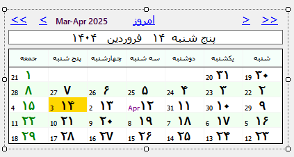
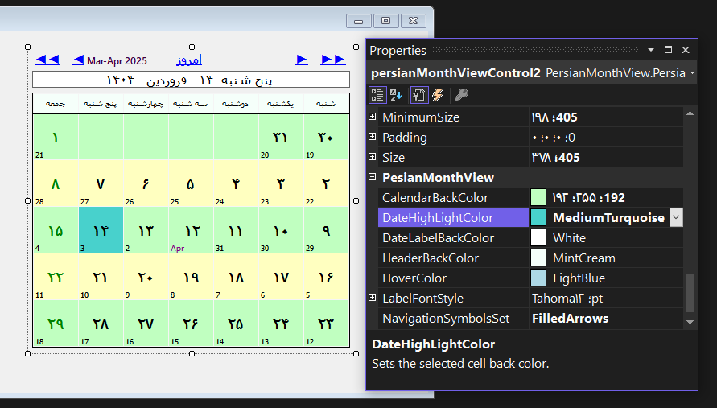
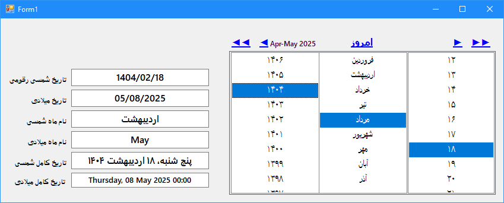
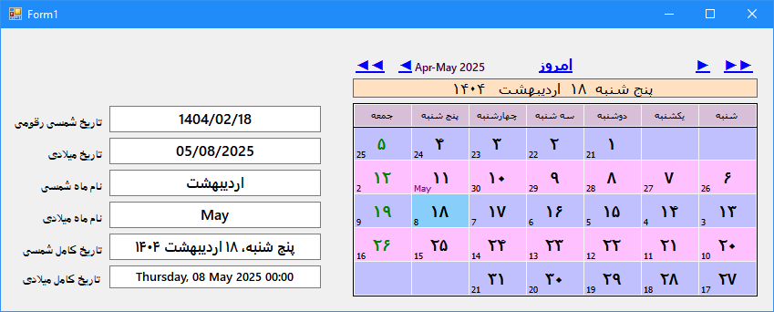

<div dir="rtl">

# انتخابگر تاریخ فارسی (ماهانه)
**تقویم فارسی ماهانه با قابلیت انتخاب و استفاده از تاریخ انتخاب شده که مستقل از تقویم سیستم و بر اساس تقویم استاندارد عمل می کند.**


## امکانات
- پشتیبانی از تقویم جلالی (فارسی)
- نمایش تاریخ میلادی و قمری به صورت همزمان
- امکان انتخاب تاریخ سریع به صورت تعاملی
- امکان شخصی سازی اندازه کنترل، رنگهای پایه، فونت نمایش تاریخ به حروف.
- برگرداندن تاریخ انتخاب شده در قالب دو آبجکت DateTime و MD.PersianDateTime.


## نصب
  از طریق NuGet اقدام کنید:
<div dir="ltr">

```sh
dotnet add package PersianMonthView
```

</div>

  یا از طریق ویژوال استودیو:
  
  1.**Manage NuGet Packages**را باز کنید
  
  2.`PersianMonthView` را جستجو کنید
  
  3.**Install**را انتخاب کنید.
## نحوه استفاده مستقیم:
<div dir="ltr">

```csharp
var persianDatePicker = new PersianMonthView();
Controls.Add(persianDatePicker);

// Get selected date
DateTime selectedDate = persianDatePicker.SelectedDate;
PersianDateTime persianSelectedDate = persianDatePicker.SelectedPersianDate;
```
</div>

  این کنترل رایگان و [تحت لایسنس](./LICENSE.txt) **[MIT](https://en.wikipedia.org/wiki/MIT_License)** می باشد.
    
***
  **برای کسب اطلاعات بیشتر جهت استفاده از امکانات آبجکت MD.PersianDateTime به [اینجا](https://github.com/Mds92/MD.PersianDateTime) مراجعه کنید**\
  **با تشکر آقای [محمد دیان](https://github.com/Mds92)**
***

## لیست تغییرات:
- ## ver 1.1.1
- اضافه کردن تاریخ هجری قمری به کنترل 
- تغییر جزیی UI جهت رفع مشکل همپوشانی لیبل ماه ها و لینک لیبل های نویگیشن
- اضافه کردن قابلیت نمایش روزهای تعطیل رسمی به شکل سلول های با نوشته قرمز
- اضافه کردن ویژگی تنظیم تاریخ هجری قمری جهت همرسانی تقویم با تاریخ رسمی
- ### ver 1.1.0
	- اضافه کردن تاریخ میلادی به صورت پایین نویس در گوشه پایین سلول ها
	- اضافه کردن تول تیپ نمایش تاریخ شمسی و میلادی  با قرار گیری روی سلول
- ### ver 1.0.5 (منتشر نشده)
	- رفع مشکل عدم نمایش لیست روزها در انتخاب سریع تاریخ
- ### ver 1.0.4-BetaTest
	- رفع مشکل تغییر سایز کنترل هنگام اضافه کردن به گروپ باکس با فونت سایز متفاوت
	- نسخه تست دنیای واقعی
- ### ver 1.0.3
	- رفع باگ مربوط به Tag که باعث عدم اضافه شدن کنترل می شد.
- ### ver 1.0.2
	- به روز رسانی لایسنس و افزودن این فایل خلاصه
- ### ver 1.0.1
	-پنهان سازی Tag به دلیل کاربرد منطقی
- ### ver 1.0.0
	- نسخه اولیه
***
**با من در تماس باشید:
[amin.shafeie@outlook.com](mailto:amin.shafeie@outlook.com)**

***

## تصاویر
<p align="center">
	 کنترل خام <br>
	
</p>
<p align="center">
	 ویژگی های کنترل  <br>
	
</p>
<p align="center">
	تصویر ویژگی انتخاب سریع  <br>
	
</p>

<p align="center">
	 نمونه اجرایی  <br>
	
</p>

# استفاده از رویداد Cell_Clicked_ مربوط به تصویر آخر
<div dir="ltr">

```csharp
private void persianMonthViewControl2_CellClicked(object sender, PersianMonthView.CellClickedEventArgs e)
        {
            textBox1.Text=e.PersianDate.ToShortDateString();
            textBox2.Text=e.GregorianDate.ToString("d",CultureInfo.InvariantCulture);
            textBox3.Text = e.PersianDate.GetLongMonthName;
            textBox4.Text=e.GregorianDate.ToString("MMM",CultureInfo.InvariantCulture);
            textBox5.Text=e.PersianDate.ToLongDateString();
            textBox6.Text=e.GregorianDate.ToString("f",CultureInfo.InvariantCulture);
        }
```
</div>

</div>

***
# PersianMonthView

**A Persian month view date picker (independent of system calendar and locale).**

## Features
- Supports **Persian calendar** (Jalali).
- Allows **quick date selection** with an interactive UI.
- Includes **year, month, and day selection popups**.

## Installation
Install via NuGet:
```sh
dotnet add package PersianMonthView
```
Or, using Visual Studio:
1. Open **Manage NuGet Packages**.
2. Search for `PersianMonthView`.
3. Click **Install**.

## Usage Example
``` 
csharp
var persianDatePicker = new PersianMonthView();
Controls.Add(persianDatePicker);

// Get selected date
DateTime selectedDate = persianDatePicker.SelectedDate;
PersianDateTime persianSelectedDate = persianDatePicker.SelectedPersianDate;
```
## 📋 Changelog
- ver 1.1.1
	- Added Lunar Hijri (Islamic) calendar to control
	- Change the UI to fix the problem of months label covering navigations link labels
	- Added the feature to show Holidays as red text cells (Bug due to Hijri difference)
	- Added a properties to adjust the Hijri Calendar and align with official date
- ver 1.1.0
	- Added Gregorian date as a subscript in the bottom corner of calendar cells
	- Added tooltip displaying both Persian and Gregorian dates on cell hover
- ver 1.0.5
	- Fixed issue where day list was not displayed in quick date selection
- ver 1.0.4-BetaTest
	- Fixed control size change when added to a GroupBox with different font size
	- Real-world test version
- ver 1.0.3
	- Fixed a bug where Tag prevented the control from being added
- ver 1.0.2
	- Updated license
	- Added this summary changelog
- ver 1.0.1
	- Tag hidden due to logical necessity
- ver 1.0.0
	- Initial release 

***

## License

This package is FREE and [licensed](./LICENSE.txt) under the **[MIT License](https://en.wikipedia.org/wiki/MIT_License)**.
***
**Thanks to [Mohammad Dayyan](https://github.com/Mds92)**\
**For more information on how to use PersianDateTime object features please refer [here](https://github.com/Mds92/MD.PersianDateTime)**

***
**Contact me at: [amin.shafeie@outlook.com](mailto:amin.shafeie@outlook.com)**
***
